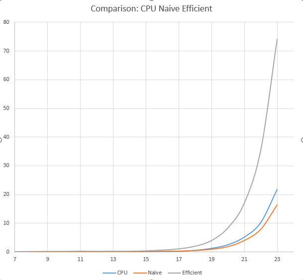
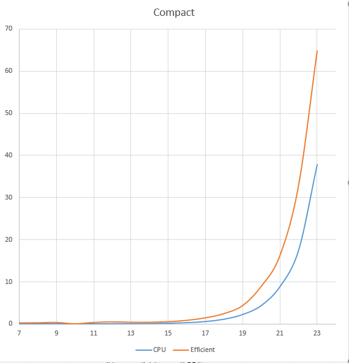
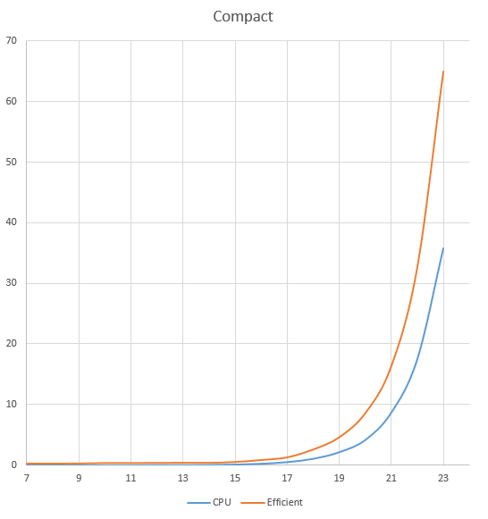
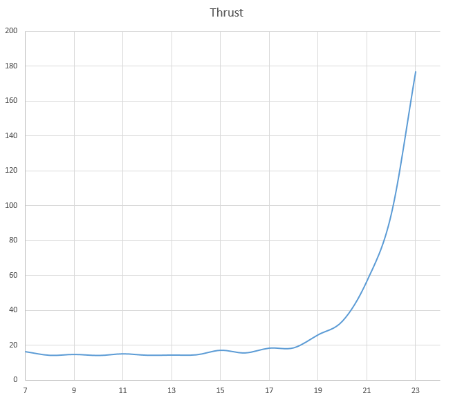
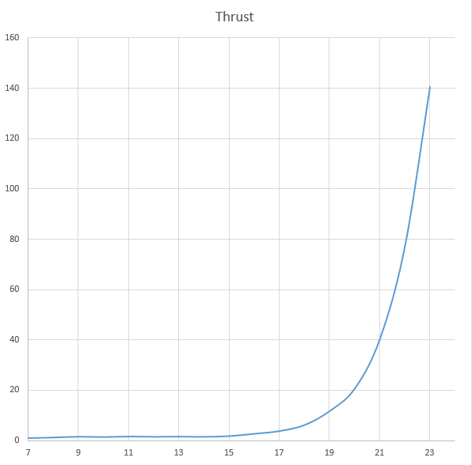

CUDA Stream Compaction
======================

**University of Pennsylvania, CIS 565: GPU Programming and Architecture, Project 2**

* Name: Bowen Yang
  * [LinkedIn](https://www.linkedin.com/in/%E5%8D%9A%E6%96%87-%E6%9D%A8-83bba6148)
  * [GitHub](https://github.com/Grillnov)
  * [Facebook](https://www.facebook.com/yang.bowen.7399)
  * [Steam](https://steamcommunity.com/id/grillnov)
* Tested on: Windows 10 x64, i7-6800K @ 3.40GHz 32GB, GTX 1080 8GB (Personal computer at home)

**Description**

Stream compaction from scratch. In our case, we're to filter out all the elements that equals to 0. Analogly it's the dead paths in the list of all the rays.

*Part 1: CPU implementation*
*Part 2: Brute force naive reduction on GPU*
*Part 3: Efficient implementation that's actually not so efficient*
*Part 4: Thrust*

**Issues**

Just as always, I modified the `sm_20` option to `sm_60` to make it compile on nvcc 9.2.

**Performance Test**

**Scan**

*When element number is exactly 2-power*



*When element number is not exactly 2-powered*


**Compaction**

*When element number is exactly 2-powered*



*When element number is not exactly 2-powered*



**Thrust implementation**

*When element number is exactly 2-powered*



*When element number is not exactly 2-powered*



**The results

```
****************
** SCAN TESTS **
****************
    [  34  23  45  34  24  43  35  44  26  22  13  28  37 ...  47   0 ]
==== cpu scan, power-of-two ====
   elapsed time: 0.001204ms    (std::chrono Measured)
    [   0  34  57 102 136 160 203 238 282 308 330 343 371 ... 6116 6163 ]
==== cpu scan, non-power-of-two ====
   elapsed time: 0.001205ms    (std::chrono Measured)
    [   0  34  57 102 136 160 203 238 282 308 330 343 371 ... 6064 6085 ]
    passed
==== naive scan, power-of-two ====
   elapsed time: 0.033792ms    (CUDA Measured)
    passed
==== naive scan, non-power-of-two ====
   elapsed time: 0.032896ms    (CUDA Measured)
    passed
==== work-efficient scan, power-of-two ====
   elapsed time: 0.123904ms    (CUDA Measured)
    passed
==== work-efficient scan, non-power-of-two ====
   elapsed time: 0.126976ms    (CUDA Measured)
    passed
==== thrust scan, power-of-two ====
   elapsed time: 13.1891ms    (CUDA Measured)
    passed
==== thrust scan, non-power-of-two ====
   elapsed time: 0.96256ms    (CUDA Measured)
    passed

*****************************
** STREAM COMPACTION TESTS **
*****************************
    [   0   3   3   0   1   2   0   2   2   2   1   2   2 ...   3   0 ]
==== cpu compact without scan, power-of-two ====
   elapsed time: 0.001506ms    (std::chrono Measured)
    [   3   3   1   2   2   2   2   1   2   2   3   2   1 ...   3   3 ]
    passed
==== cpu compact without scan, non-power-of-two ====
   elapsed time: 0.002108ms    (std::chrono Measured)
    [   3   3   1   2   2   2   2   1   2   2   3   2   1 ...   2   3 ]
    passed
==== cpu compact with scan ====
   elapsed time: 0.003313ms    (std::chrono Measured)
    [   3   3   1   2   2   2   2   1   2   2   3   2   1 ...   3   3 ]
    passed
==== work-efficient compact, power-of-two ====
   elapsed time: 0.23984ms    (CUDA Measured)
    passed
==== work-efficient compact, non-power-of-two ====
   elapsed time: 0.238592ms    (CUDA Measured)
    passed
```

**The explanation for the efficiency of the efficient implementation**

From the charts we find the surprising fact that, *efficient* implementation is actually not that efficient.
2 main reasons for this to happen:

**I/O intensive**
In our efficient implementation, we have to write the initial element to the GPU buffer or read the last element of the buffer back. This causes lots of system interrupts and therefore is harmful to performance.

**The reduce algorithm itself**
With the layer going even deeper, stride becomes larger and larger, which, is a behavior that all caches hate. The spatial locality is horrible when the layer goes deep.

**Something wrong with the thread scheduling**
With the layer going deeper, more and more threads become idle and does nothing useful, and even worse, with the stride growing larger, branch divergence inside warps is getting unacceptable.
